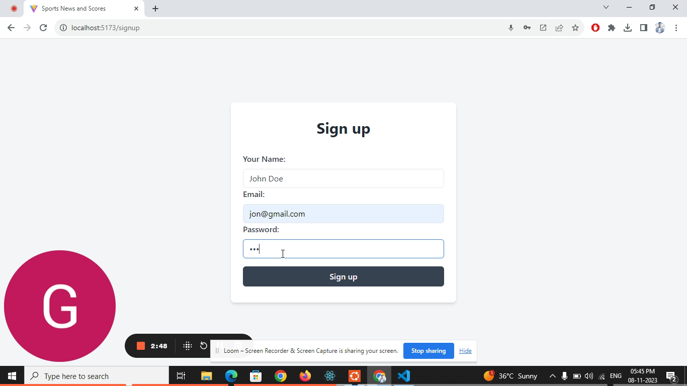

# Sports News and Scores Dashboard

**Built with React.js and TypeScript**

## Project Description

This is a Sports News and Scores Dashboard built using Reactjs and Typescript that provides users with up-to-date sports news articles and live scores for various sports. It allows users to stay informed about their favorite sports, read news articles, and track live match scores, all in one place

### What Does it Do?

Our Sports News and Scores Dashboard offers a comprehensive set of features that enhance your sports-watching experience:

- **Browse Sports News**: Stay informed with a constantly updated feed of sports news articles. Each article is accompanied by a title, summary, and a captivating image. Click on an article to read the full story.

- **Filter News Articles**: Tailor your news feed by filtering articles based on the sports you love. No need to refresh the page - the content updates in real-time as you adjust your preferences.

- **View Live Scores and Match Details**: Want to know the score of the game? Our dashboard provides a list of ongoing matches, their scores, and relevant match details. Check out the teams playing and their current score.

- **Personalize Dashboard**: Create an account and sign in to customize your dashboard. Select your favorite sports and teams to receive news and score updates that match your interests.

### Special Features

- **User-Friendly Interface**: We've designed our dashboard with a user-friendly interface that makes navigation a breeze. The landing screen features live scores and trending news articles by sport, ensuring you're always in the know.

- **Filter Layout**: Easily select sports and teams to filter news articles that matter to you. Our filter layout simplifies the process, so you can focus on the content you love.

- **Sign-in and Sign-up Pages**: Access the sign-in and sign-up pages directly from the navigation bar. New users can register and create an account, while existing users can quickly sign in.

- **Detailed News Article View**: Clicking on "Read More" opens a pop-up with a detailed view of the news article. You'll see a captivating image and relevant content in an easy-to-read format.

- **Preferences Screen**: Customize your experience by accessing the preferences screen as a pop-up or modal dialogue. Select the sports and teams that matter most to you.

- **Filtering Based on User Preferences**: When you're logged in, the application automatically filters news articles based on your selected preferences. Say goodbye to irrelevant content.

## Screenshots

Here are some screenshots to give you a sneak peek of our Sports News and Scores Dashboard:

## Live Application

Ready to dive in and explore the dashboard? Visit our live application by clicking [here](https://yourappurl.com). Sign up and start customizing your sports news and scores experience today.

## Video Screencast

To help you get started quickly and make the most of our dashboard, we've created a video screencast that provides a step-by-step tutorial. Watch the video [here](https://shorturl.at/bkHY5) to master the application's features.
